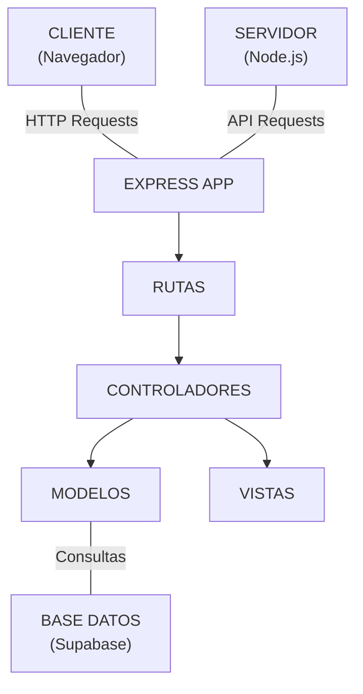
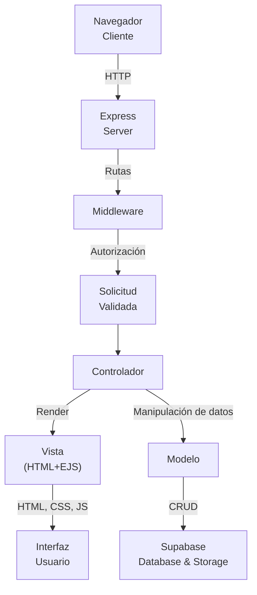
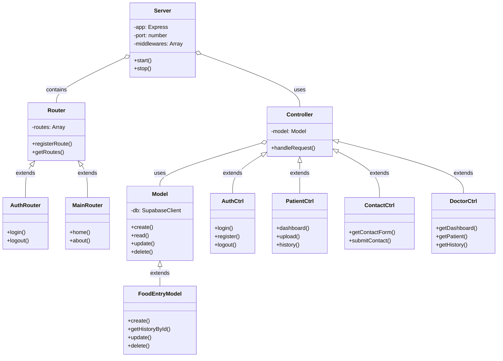
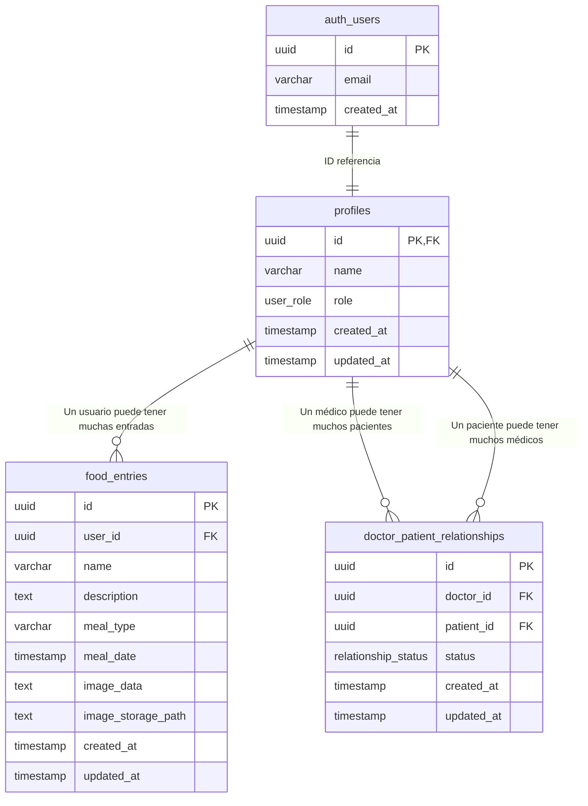
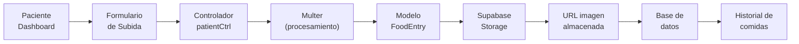
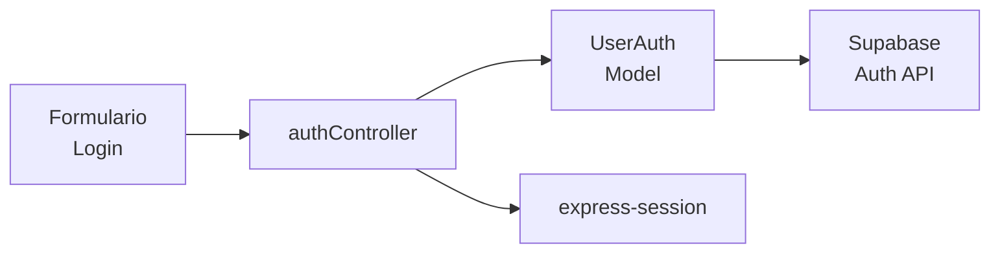

# Diagramas de WhatYouEat

## Arquitectura General de la Aplicación

## Diagrama de Flujo de Datos

*Nota: Este diagrama representa la arquitectura conceptual. Los nombres específicos de archivos y clases pueden variar ligeramente en la implementación.*

## Diagrama de Clases (POO)

*Nota: Este diagrama es una representación conceptual de alto nivel. Los nombres de las clases pueden no coincidir exactamente con los nombres de los archivos o módulos en el código fuente. Por ejemplo, `AuthRouter` representa la lógica de rutas en `routes/authRoutes.js` y los controladores asociados en `controllers/auth/`.*

## Diagrama Entidad-Relación (Base de Datos)

## Flujo de Usuario - Subida de Imagen de Comida

## Flujo de Autenticación y Sesiones

