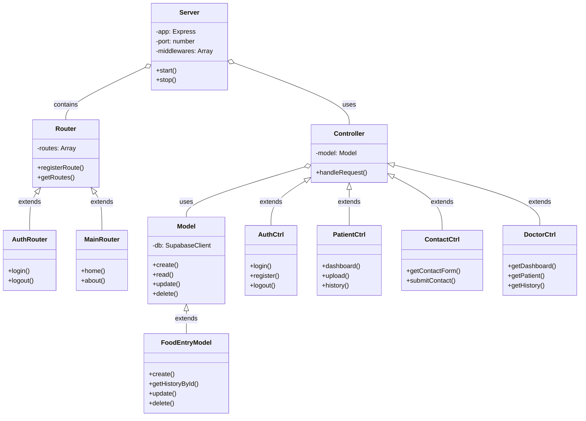

# Diagramas de Interrelación de Ficheros

## Arquitectura General de la Aplicación

```
+----------------+     +----------------+     +----------------+
|                |     |                |     |                |
|     CLIENTE    |     |     SERVIDOR   |     |   BASE DATOS   |
|  (Navegador)   |     |    (Node.js)   |     |   (Supabase)   |
|                |     |                |     |                |
+-------+--------+     +-------+--------+     +-------+--------+
        |                      |                      |
        | HTTP                 | API                  |
        | Requests             | Requests             |
        ↓                      ↓                      |
+-------+------------------------+                    |
|                                |                    |
|          EXPRESS APP           |                    |
+-+------------+------------+----+                    |
  |            |            |                         |
  |            |            |                         |
  ↓            ↓            ↓                         |
+-----+     +-----+     +-----+                       |
|     |     |     |     |     |                       |
|RUTAS|---->|CONTR|---->|MODEL|---------------------->+
|     |     |     |     |     |
+-----+     +--+--+     +-----+
               |
               ↓
            +-----+
            |     |
            |VISTA|
            |     |
            +-----+
```

## Diagrama de Flujo de Datos

```
+-------------+         +------------+         +-------------+
|             |  HTTP   |            |  Rutas  |             |
|  Navegador  +-------->+  Express   +-------->+  Middleware |
|   Cliente   |         |   Server   |         |             |
+-------------+         +------------+         +------+------+
                                                     |
                                                     | Autorización
                                                     ↓
+-------------+         +------------+         +-------------+
|             |         |            |         |             |
|    Vista    <---------+ Controlador<---------+  Solicitud  |
|  (HTML+EJS) |  Render |            |  Validada    |
+------+------+         +-----+------+         +-------------+
       |                      |
       | HTML, CSS, JS        | Manipulación
       ↓                      | de datos
+-------------+         +-------------+         +-------------+
|             |         |             |         |             |
|  Interfaz   |         |   Modelo    |         |  Supabase   |
|  Usuario    |         |             +-------->+  Database   |
+-------------+         +-------------+  CRUD   |  & Storage  |
                                                +-------------+
```

## Diagrama de Clases (POO)



## Diagrama Entidad-Relación (Base de Datos)

```
+----------------------+       +-------------------------+
|      auth.users      |       |        profiles         |
+----------------------+       +-------------------------+
| id (PK) UUID         |<----->| id (PK, FK) UUID        |
| email VARCHAR        |       | name VARCHAR            |
| encrypted_password   |       | role VARCHAR            |
| email_confirmed_at   |       | created_at TIMESTAMP    |
| last_sign_in_at      |       | updated_at TIMESTAMP    |
| created_at TIMESTAMP |       +-------------------------+
+----------+-----------+                 |
           |                             |
           |                             |
           |                             |
           |                             |
           |                             v
           |              +--------------------------------+
           |              |          food_entries          |
           |              +--------------------------------+
           +------------->| id (PK) UUID                   |
                          | user_id (FK) UUID              |
                          | image_url VARCHAR              |
                          | comments TEXT                  |
                          | ingredients TEXT               |
                          | created_at TIMESTAMP           |
                          | updated_at TIMESTAMP           |
                          +--------------------------------+
```

## Flujo de Usuario - Subida de Imagen de Comida

```
+-------------+     +---------------+     +-----------------+
|             |     |               |     |                 |
|  Paciente   +---->+  Formulario   +---->+  Controlador    |
|  Dashboard  |     |  de Subida    |     |  patientCtrl    |
+-------------+     +---------------+     +-------+---------+
                                                 |
                                                 v
+-----------------+     +---------------+     +----------------+
|                 |     |               |     |                |
|   Supabase      <-----+   Modelo      <-----+    Multer     |
|   Storage       |     |  FoodEntry    |     | (procesamiento)|
+--------+--------+     +---------------+     +----------------+
         |
         v
+-----------------+     +---------------+     +----------------+
|                 |     |               |     |                |
|  URL imagen     +---->+  Base de      +---->+  Historial de  |
|  almacenada     |     |  datos        |     |  comidas       |
+-----------------+     +---------------+     +----------------+
```

## Estructura de Archivos Detallada

```
whatyoueat/
  ├── server.js                 # Punto de entrada de la aplicación
  ├── package.json              # Dependencias y scripts
  ├── LICENSE                   # Licencia del proyecto
  ├── README.md                 # Documentación general
  │
  ├── config/                   # Configuraciones
  │     └── supabase.js         # Configuración de la conexión a Supabase
  │
  ├── controllers/              # Controladores
  │     ├── authController.js   # Manejo de autenticación
  │     ├── contactController.js # Gestión del formulario de contacto
  │     ├── doctorController.js # Funcionalidades específicas de médicos
  │     └── patientController.js # Funcionalidades específicas de pacientes
  │
  ├── database/                 # Archivos relacionados con la BD
  │     ├── init.sql           # Script SQL para inicializar la base de datos
  │     └── testDB.js          # Pruebas de conexión a la BD
  │
  ├── docs/                     # Documentación técnica
  │     ├── diagrams.md         # Diagramas de la arquitectura
  │     ├── patterns.md         # Patrones de diseño implementados  
  │     └── validation.md       # Validación de estándares web
  │
  ├── middleware/               # Middlewares
  │     └── authMiddleware.js   # Middleware de autenticación y autorización
  │
  ├── models/                   # Modelos
  │     ├── FoodEntry.js        # Modelo para gestión de entradas de comida
  │     ├── Profile.js          # Modelo para gestión de perfiles de usuario
  │     └── UserAuth.js         # Modelo para gestión de autenticación
  │
  ├── public/                   # Archivos estáticos
  │     ├── css/
  │     │     └── styles.css    # Estilos CSS principales
  │     │
  │     ├── img/                # Imágenes
  │     │     ├── logo.png      # Logo de la aplicación
  │     │     ├── demo/         # Imágenes de demostración
  │     │     └── temp/         # Almacenamiento temporal
  │     │
  │     └── js/                 # JavaScript del cliente
  │           ├── auth.js       # Funciones de autenticación
  │           ├── main.js       # Funciones principales
  │           └── valForm/
  │                 └── contactFormVal.js # Validación del formulario de contacto
  │
  ├── routes/                   # Rutas
  │     ├── authRoutes.js       # Rutas de autenticación
  │     ├── doctorRoutes.js     # Rutas específicas para médicos
  │     ├── mainRoutes.js       # Rutas principales/públicas
  │     └── patientRoutes.js    # Rutas específicas para pacientes
  │
  ├── utils/                    # Utilidades
  │     └── generateSecret.js   # Generador de secretos seguros para sesiones
  │
  └── views/                    # Vistas (archivos HTML procesados con EJS)
        ├── 404.html            # Página de error 404
        ├── contact.html        # Página de contacto
        ├── index.html          # Página de inicio
        │
        ├── auth/               # Vistas de autenticación
        │     ├── login.html    # Página de inicio de sesión
        │     └── register.html # Página de registro
        │
        ├── doctor/             # Vistas para médicos
        │     └── dashboard.html # Dashboard del médico
        │
        ├── layouts/            # Plantillas base
        │     └── main.html     # Layout principal
        │
        └── patient/            # Vistas para pacientes
              ├── dashboard.html # Dashboard del paciente
              └── upload.html   # Formulario de subida de fotos
```

## Flujo de Autenticación y Sesiones

```
+------------------+    +------------------+    +------------------+
|                  |    |                  |    |                  |
| Formulario Login +---->  authController  +---->  UserAuth Model  |
|                  |    |                  |    |                  |
+------------------+    +--------+---------+    +--------+---------+
                                 |                       |
                                 |                       |
                                 v                       v
                        +--------+---------+    +--------+---------+
                        |                  |    |                  |
                        | express-session  |    |    Supabase      |
                        |                  |    |    Auth API      |
                        +------------------+    +------------------+
```