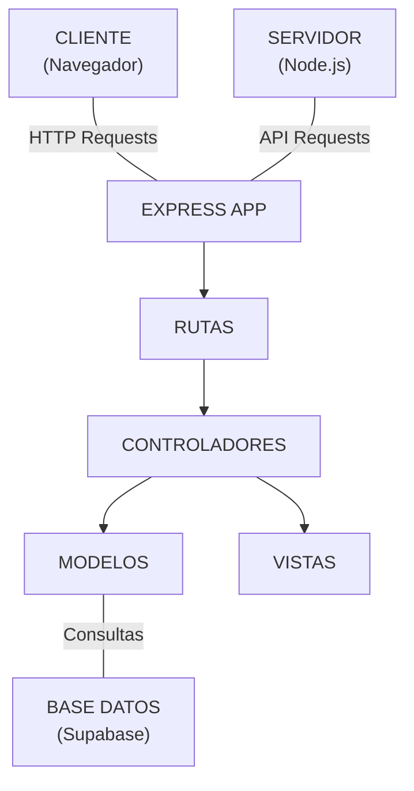
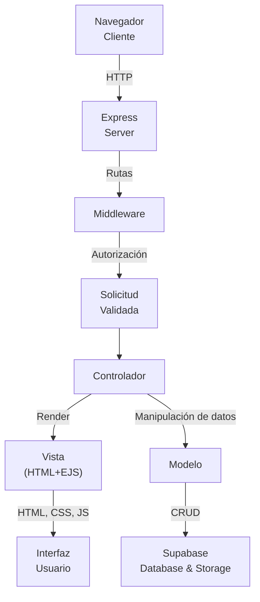
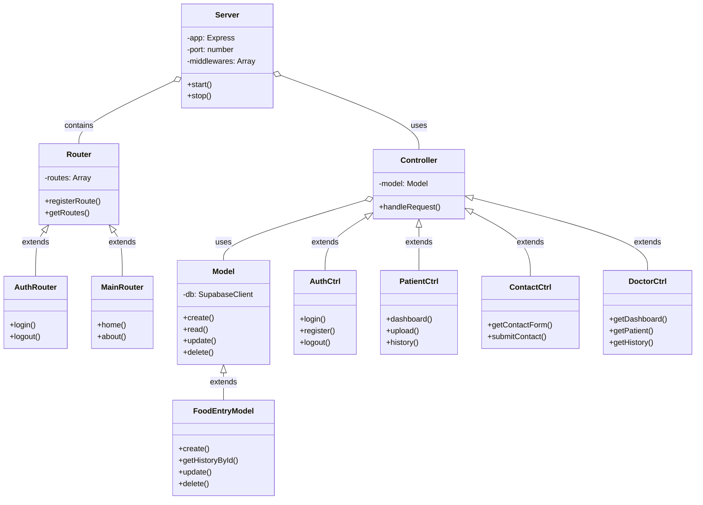
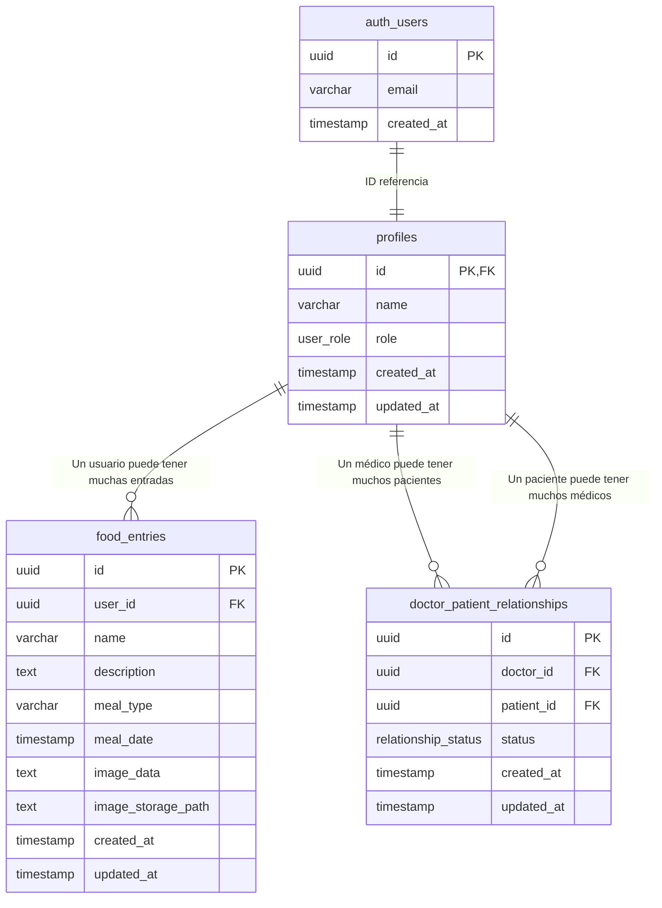
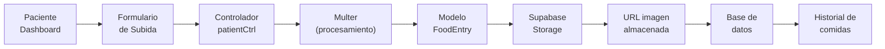
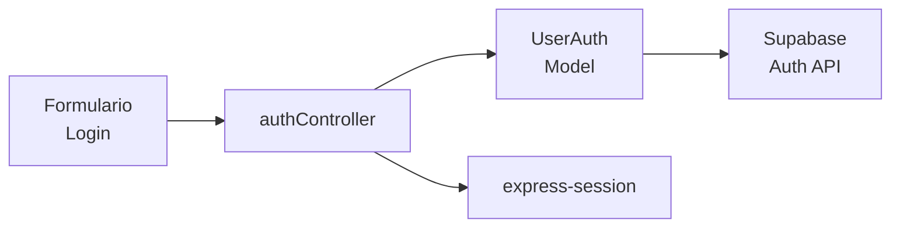

# Diagramas de WhatYouEat

## Arquitectura General de la Aplicación

## Diagrama de Flujo de Datos

## Diagrama de Clases (POO)

## Diagrama Entidad-Relación (Base de Datos)

## Flujo de Usuario - Subida de Imagen de Comida

## Estructura de Archivos Detallada

```mermaid
graph TD
    Raiz[whatyoueat/] --> Server[server.js]
    Raiz --> Package[package.json]
    Raiz --> License[LICENSE]
    Raiz --> Readme[README.md]
    
    Raiz --> Config[config/]
    Config --> SupabaseConfig[supabase.js]
    
    Raiz --> Controllers[controllers/]
    Controllers --> AuthController[authController.js]
    Controllers --> ContactController[contactController.js]
    Controllers --> DoctorController[doctorController.js]
    Controllers --> PatientController[Patient/]
    PatientController --> Dashboard[dashboardController.js]
    PatientController --> EntryDetail[entryDetailController.js]
    PatientController --> FoodHistory[foodHistoryController.js]
    PatientController --> IndexCtrl[index.js]
    PatientController --> UploadController[uploadController.js]
    
    Raiz --> Database[database/]
    Database --> InitSQL[init.sql]
    
    Raiz --> Docs[docs/]
    Docs --> Diagrams[diagrams.md]
    Docs --> Patterns[patterns.md]
    Docs --> Validation[validation.md]
    
    Raiz --> Middleware[middleware/]
    Middleware --> AuthMiddleware[authMiddleware.js]
    Middleware --> PatientMiddleware[patient/]
    PatientMiddleware --> OwnerMiddleware[entryOwnershipMiddleware.js]
    
    Raiz --> Models[models/]
    Models --> DoctorPatient[DoctorPatient.js]
    Models --> FoodEntry[FoodEntry.js]
    Models --> Profile[Profile.js]
    Models --> UserAuth[UserAuth.js]
    
    Raiz --> Public[public/]
    Public --> CSS[css/]
    CSS --> Styles[styles.css]
    Public --> Img[img/]
    Img --> EmptyPlate[empty-plate.svg]
    Img --> HeroImage[hero-image.png]
    Img --> Logo[logo.webp]
    Public --> JS[js/]
    JS --> Auth[auth.js]
    JS --> EntryDetail[entry-detail.js]
    JS --> History[history.js]
    JS --> Main[main.js]
    JS --> Upload[upload.js]
    JS --> Validators[validators/]
    Validators --> ContactFormValidator[contactFormValidator.js]
    Validators --> RegisterFormValidator[registerFormValidator.js]
    
    Raiz --> Routes[routes/]
    Routes --> AuthRoutes[authRoutes.js]
    Routes --> DoctorRoutes[doctorRoutes.js]
    Routes --> MainRoutes[mainRoutes.js]
    Routes --> PatientRoutes[patientRoutes.js]
    
    Raiz --> Utils[utils/]
    Utils --> ErrorHandler[errorHandler.js]
    Utils --> GenerateSecret[generateSecret.js]
    Utils --> Validators[validators/]
    Validators --> FoodEntryValidator[foodEntryValidator.js]
    
    Raiz --> Views[views/]
    Views --> Contact[contact.html]
    Views --> Index[index.html]
    Views --> Profile[profile.html]
    Views --> Auth[auth/]
    Auth --> Login[login.html]
    Auth --> Register[register.html]
    Views --> Doctor[doctor/]
    Doctor --> DoctorDashboard[dashboard.html]
    Doctor --> PatientHistory[patient-history.html]
    Views --> Errors[errors/]
    Errors --> Error404[404.html]
    Errors --> Error500[500.html]
    Views --> Layouts[layouts/]
    Layouts --> ErrorLayout[error.html]
    Layouts --> MainLayout[main.html]
    Views --> Patient[patient/]
    Patient --> PatientDashboard[dashboard.html]
    Patient --> EditEntry[edit-entry.html]
    Patient --> EntryDetail[entry-detail.html]
    Patient --> History[history.html]
    Patient --> Upload[upload.html]
```

## Flujo de Autenticación y Sesiones

